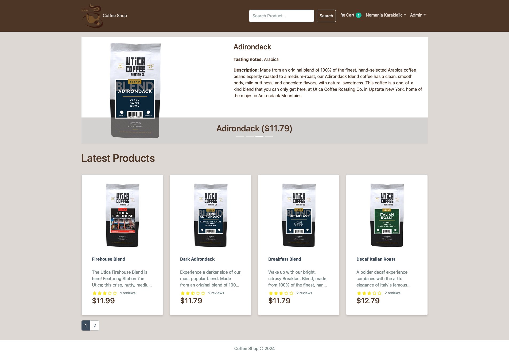
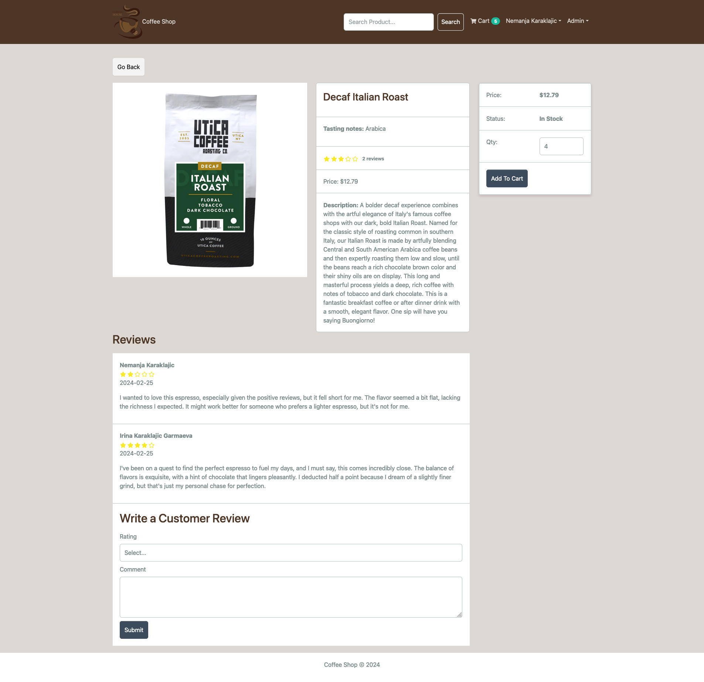
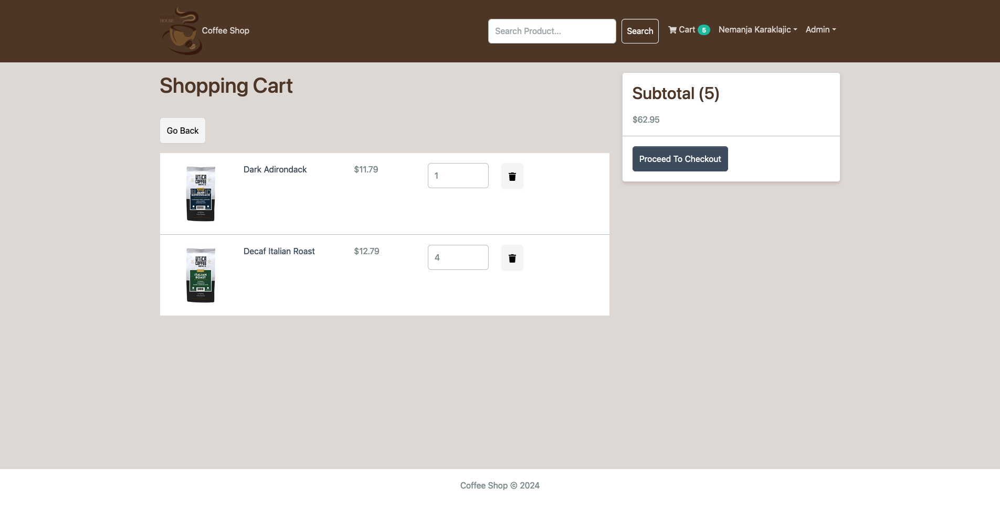
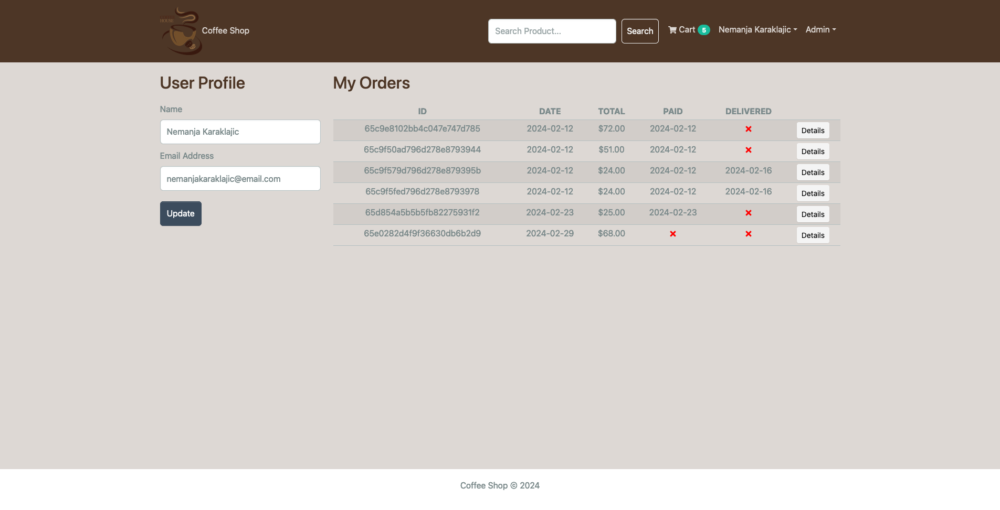
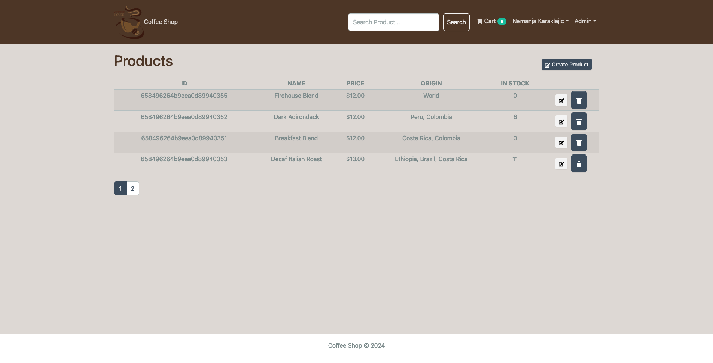

# CoffeeShop E-commerce Platform

Welcome to the CoffeeShop E-commerce Platform - your go-to solution for exploring and purchasing the finest coffee blends. Built with a modern tech stack, this full-stack application offers a seamless shopping experience, from browsing products to making secure payments.



<details>
    <summary>Click to show more</summary>
    
    
    
    
</details>

## Features

- **User Authentication**: Secure login and registration system to keep your account safe.
- **Product Listing**: Explore a wide range of coffee blends with detailed descriptions.
- **Search Functionality**: Find your favorite coffee quickly with our intuitive search feature.
- **Shopping Cart**: Add items to your cart and review them before purchase.
- **Checkout Process**: A streamlined checkout process, including address information and payment options.
- **Order History**: View your past orders and track the status of your current orders.
- **Admin Panel**: An exclusive area for admins to manage products, users, and orders.
- **Responsive Design**: Enjoy a great shopping experience on any device.
- **Payment Integration**: Securely process payments via PayPal.

## Tech Stack

### Frontend

- React
- TypeScript
- Bootstrap
- Redux Toolkit & RTK Query
- Vite

### Backend

- Node.js
- Express
- MongoDB
- Mongoose

## Getting Started

Follow these instructions to get your copy of the project up and running on your local machine for development and testing purposes.

### Prerequisites

- Node.js
- npm or yarn
- MongoDB

### Installation

1. Clone the repository:
   ```sh
   git clone https://github.com/letStayFoolish/e-commerce-app
   ```
2. Install NPM packages for both frontend and backend:

# For frontend

```
cd frontend
npm install
```

# For backend (project's root)

```
npm install
```

3. Set up your environment variables:
   - Create a .env file in the backend directory.
   - Add your MongoDB URI, JWT secret, and PayPal client ID as follows:

```
NODE_ENV=production/development
PORT=port-number(5000)
MONGO_URI=your mongoDB uri
JWT_SECRET=jwt secret key (generated)
PAYPAL_CLIENT_ID=paypal id
PAGINATION_LIMIT=items per page(4)

```

# Running the Application

### 1. Start the backend server:

```sh
npm run server
```

### 2. Start the frontend application:

```sh
cd frontend
npm run dev

```

### 3. Start the full application (root):

```sh

npm run dev

```

### 4. Open your browser and navigate to http://localhost:5173 to see the application in action.

## Contributing

Contributions are what make the open-source community such an amazing place to learn, inspire, and create. Any contributions you make are greatly appreciated.

- Fork the Project
- Create your Feature Branch (git checkout -b feature/AmazingFeature)
- Commit your Changes (git commit -m 'Add some AmazingFeature')
- Push to the Branch (git push origin feature/AmazingFeature)
- Open a Pull Request

## License

Distributed under the MIT License.

## Contact

Karaklajic Nemanja - <a to='mailto:nemanjakaraklajic90@gmail.com'>nemanjakaraklajic90@gmail.com</a>

Project Link:

- GitHub: [https://github.com/letStayFoolish/e-commerce-app](https://github.com/letStayFoolish/e-commerce-app)
- Deploy: [https://e-commerce-app-3n9w.onrender.com/](https://e-commerce-app-3n9w.onrender.com/)

## Acknowledgements

- [React](https://react.dev/)
- [Node.js](https://nodejs.org/en)
- [MongoDB](https://www.mongodb.com/)
- [Bootstrap](https://getbootstrap.com/)
- [Vite](https://vitejs.dev/)
- [Redux Toolkit](https://redux-toolkit.js.org/)
